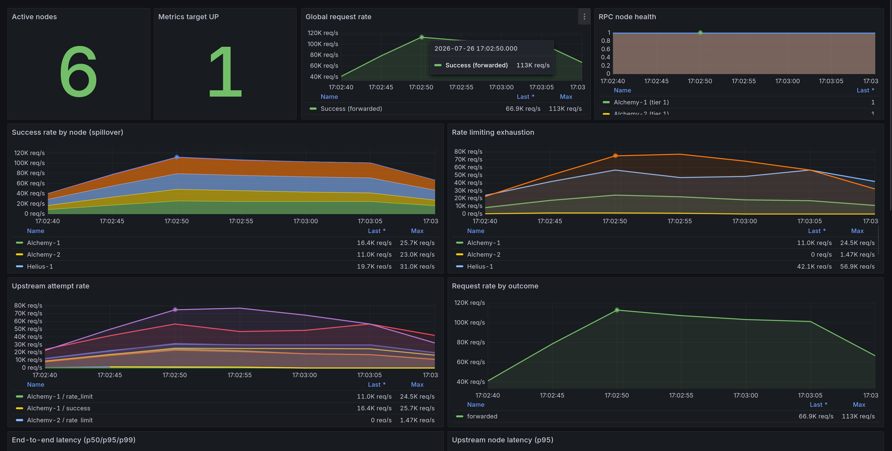
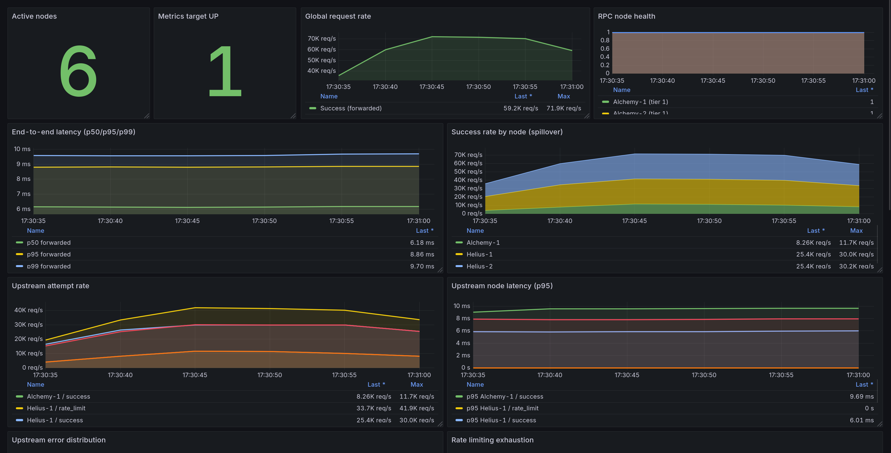

# RPC Load Balancer

High-performance JSON-RPC reverse proxy for Solana, written in Rust: lock-free routing, tier-based smart spillover, and **sub-millisecond proxy overhead at 113,000 RPS**.

---

## Benchmarks

Test bench: single Linux host (loopback), 6 mock RPC nodes (`src/bin/mock_node.rs`) with hardcoded response latencies, config from `config/mock_nodes.toml`, `--release` build. Metrics scraped by Prometheus from `/metrics` and rendered by the bundled Grafana dashboard.

### Run 1 — Raw throughput (no artificial node latency)



| Metric | Value |
| --- | --- |
| Peak throughput (burst) | **113,000 RPS** |
| Steady-state plateau | ~101,000 RPS |
| End-to-end latency p50 | 2.55 ms |
| End-to-end latency p95 | 4.61 ms |
| End-to-end latency p99 | 5.74 ms |

99% of client requests complete in under 6 milliseconds — at over 100k RPS.

**Proxy overhead.** The fastest node (Helius-1) has a hardcoded 3.00 ms mock delay; its measured upstream p95 is 4.42 ms. So JSON parsing, the lock-free routing-table read, rate-limit checks, node selection, and byte proxying together cost **~1.42 ms**.

**Traffic distribution at peak (spillover).** The algorithm spread 113k successful req/s across nodes strictly by tier priority:

| Tier | Node | req/s |
| --- | --- | --- |
| 0 | Helius-2 | 31.7K |
| 0 | Helius-1 | 31.0K |
| 1 | Alchemy-1 | 25.7K |
| 1 | Alchemy-2 | 23.0K |
| 2 | public-mirror | 1.05K |
| 2 | Triton-1 | 0 |

**Rate-limit exhaustion (rejected locally, zero network cost).** Requests the balancer bounced off a node's exhausted token bucket without ever touching the network: Helius-2 — 75.2K/s, Helius-1 — 56.9K/s, Alchemy-1 — 24.5K/s, Alchemy-2 — 1.47K/s. Provider limits stay respected; excess traffic cascades down the tiers instead of collecting 429s.

### Run 2 — Real-world latency (nodes with simulated network delay)



Mock node delays: Helius-1 — 3 ms, Helius-2 — 5 ms, Alchemy-1 — 7 ms.

| Metric | Value |
| --- | --- |
| Sustained peak (forwarded success) | **71,900 RPS** |
| End-to-end latency p50 | 6.14 ms |
| End-to-end latency p95 | 8.82 ms |
| End-to-end latency p99 | 9.57 ms |

The drop from 113k to 71k RPS is Little's Law at work: artificial delay keeps connections open longer, so the same concurrency yields fewer requests per second — expected, not a regression.

The gap between the median request and the worst 1% is only **~3.4 ms**. No garbage collector, no GC pauses: response time stays flat and predictable under pressure.

**Proxy overhead under load.** Measured upstream p95 from the mock servers themselves:

| Node | Hardcoded delay | Upstream p95 |
| --- | --- | --- |
| Helius-1 | 3 ms | 5.87 ms |
| Helius-2 | 5 ms | 7.83 ms |
| Alchemy-1 | 7 ms | 9.60 ms |

(The mock servers and the OS loopback add their own micro-latency at 70k RPS.) Most traffic (60k of 71k) went through Helius-1/2, which returned in ~6–7 ms — while the client-facing end-to-end p50 was 6.14 ms. The balancer's own work — parsing, the lock-free `arc-swap` table read, limit checks, byte forwarding — stays **under one millisecond**.

**Cascading spillover.** Both Tier 0 nodes hit their 30k RPS caps exactly (Helius-2 — 30.2K, Helius-1 — 30.0K); Tier 1 absorbed the overflow (Alchemy-1 — 11.7K).

---

## Why it's fast

- **Lock-free routing table (`arc-swap`).** The hot path never takes a lock: every request does an atomic pointer load of the current routing table. The health-check loop builds a new table off to the side and swaps it in atomically.
- **Zero-copy request forwarding.** The client's request body is captured as `Bytes` and proxied to upstream as-is — no deserialization, no re-serialization, cheap reference-counted clones between retries.
- **Minimal response parsing.** Upstream responses are only deserialized into a tiny `error`-field-only struct (`RpcErrorOnly`) — just enough to decide "forward or retry". The response body itself is passed back to the client untouched.
- **Concurrent burst health probing.** Every 10 s a `JoinSet` probes all nodes in parallel (3 attempts, 500 ms timeout each), then sorts survivors by `(tier, measured latency)` and publishes the new table.
- **Smart fallback state machine.** Per request:
  1. **Fail-fast** — walk the sorted node list; skip any node whose token bucket is empty (no network call, remember its earliest-refill time) or that fails with a retryable error.
  2. **Earliest-available wait** — if *every* node is rate-limited, sleep exactly until the soonest bucket refills (minimum `NotUntil` from `governor`), not a fixed backoff.
  3. **Retry** — reload the routing table and loop, bounded by a 1 s global deadline.

  Non-retryable upstream responses (e.g. HTTP 400, JSON-RPC `-32602 invalid params`) are forwarded to the client verbatim instead of being masked as a generic 502.

## Features

- **Tier-based smart spillover** — traffic fills premium (Tier 0) nodes to their caps first, then cascades to lower tiers automatically.
- **Token-bucket rate limiting per node** (`governor`) — provider RPS limits enforced locally, before any network I/O.
- **Per-node concurrency caps** (`tokio::sync::Semaphore`) — bounds in-flight requests per upstream.
- **Anti-flapping health checks** — 3 probes per cycle before declaring a node healthy; state transitions logged once, not spammed.
- **Fail-open** — if *all* nodes fail their health checks (e.g. a monitoring artifact), the balancer keeps routing to the full node list rather than going dark.
- **Graceful shutdown** — SIGINT/SIGTERM drain via `axum`'s graceful shutdown.
- **Config via TOML + env** — API keys are injected with `$VAR` substitution in URLs, never stored in config files.

## Observability

Prometheus metrics on `/metrics` (opt-in), pre-provisioned Grafana dashboard in `monitoring/`:

- `rpc_requests` / `rpc_request_duration` — client-facing outcomes and end-to-end latency histograms (p50/p95/p99).
- `rpc_upstream_attempts` / `rpc_upstream_duration` — per-node, per-outcome attempt counters and latency (success, rate_limit, transport_error, retryable/forwarded errors).
- `rpc_node_healthy`, `rpc_healthy_nodes`, `rpc_healthcheck_duration` — health-check state and timing.
- `rpc_sleep_queue_size` — requests currently parked waiting for a rate-limit window.

`GET /health` returns structured JSON: overall status (`ok` / `degraded` / `critical`), per-node up/down state, tier, and last measured latency.

See [`monitoring/README.md`](monitoring/README.md) for the local Prometheus + Grafana docker-compose setup.

## Quick start

Requires Rust (edition 2024).

```bash
git clone <repo-url> && cd RPC-Load-Balancer

# 1. Configure nodes
cp config/config.example.toml config/config.toml
cp .env.example .env            # put your API keys here

# 2. Run
CONFIG_PATH=config/config.toml cargo run --release
```

Config format (`config/config.toml`):

```toml
[server]
host = "0.0.0.0"
port = 3000
enable_metrics = false  # enable only behind an internal network boundary

[[nodes]]
name = "Helius"
url = "https://mainnet.helius-rpc.com/?api-key=$HELIUS_API_KEY"  # $VARS resolved from env
tier = 0            # 0 = highest priority
rps_limit = 50      # provider rate limit (token bucket)
max_concurrent = 16 # in-flight request cap
```

Send a request:

```bash
curl -s http://localhost:3000/send-request \
  -H 'content-type: application/json' \
  -d '{"jsonrpc":"2.0","id":1,"method":"getHealth"}'

curl -s http://localhost:3000/health | jq
```

### Reproduce the benchmarks

```bash
# Terminal 1: 6 mock nodes with configurable latencies
cargo run --release --bin mock_node

# Terminal 2: balancer pointed at the mocks
CONFIG_PATH=config/mock_nodes.toml cargo run --release

# Terminal 3: monitoring stack (Grafana on :3001, Prometheus on :9090)
GRAFANA_ADMIN_PASSWORD=<password> docker compose -f monitoring/docker-compose.yml up -d
```

Then drive load at `POST /send-request` with your generator of choice (the numbers above were produced with a Tokio-based load generator saturating the loopback) and watch the `RPC Load Balancer` dashboard.

## Endpoints

| Method | Path | Description |
| --- | --- | --- |
| `POST` | `/send-request` | Proxy a JSON-RPC request through the balancer |
| `GET` | `/health` | Balancer + per-node health JSON |
| `GET` | `/metrics` | Prometheus metrics (when `enable_metrics = true`) |

## License

[MIT](LICENSE)
